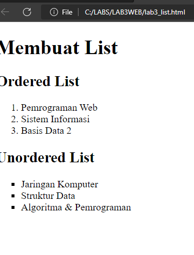
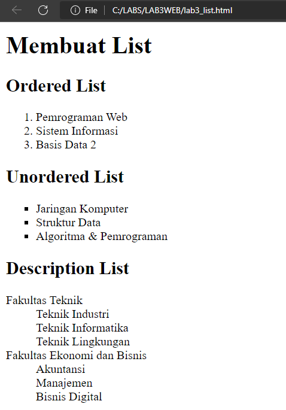
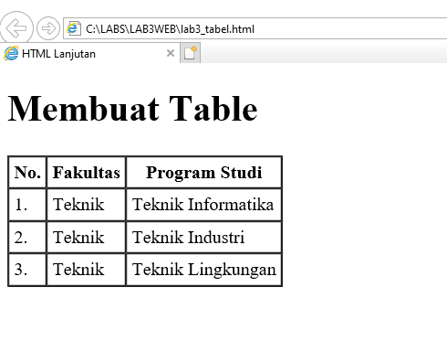
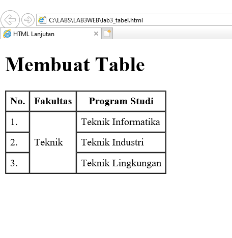
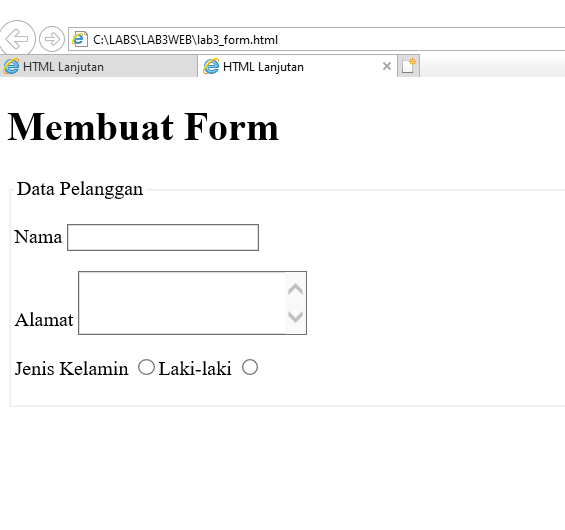
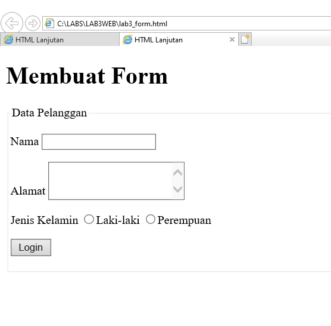
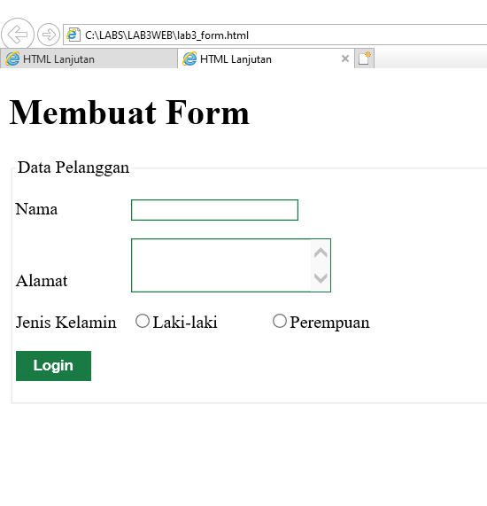

# LAB3WEB
this is my 3rd practicum assignment for the WEB Programming course

 Berikut langkah-langkah praktikum 3 : 

1. Sebelum membuat mulai kita tuliskan dulu script dasar HTML, 
2. Setelah itu tambahkan kode untuk membuat order list (lihat syntax di lembar praktikum 3)

Berikut hasilnya : 

3. Kemudian tambakan kode untuk membuat Unordered List, setelah deklarasi ordered list pada section unordered-list. (lihat syntax pada lembar praktikum)

Berikut hasilnya : 

4. Kemudian tambahkan kode untuk membuat description list setelah deklarasi unorderd-list. (lihat syntax pada lembar praktikum)

Berikut hasilnya : 

5. Buat file baru dengan nama lab3_tabel.html (lihat syntax pada lembar praktikum)

Berikut hasilnya : 

6. Menggabungkan Sel Data
Untuk menggabungkan sel data, gunakan atribut rowspan dan colspan. Atribut rowspan untuk menggabungkan baris (secara vertikal) dan colspan untuk menggabungkan kolom (secara horizontal). (lihat syntax pada lembar praktikum)

Berikut hasilnya : 

6. Membuat Form
Buat file baru dengan nama lab3_form.html seperti berikut.
Kemudian selanjutnya tambahkan kode untuk membuat tabel sederhana (lihat syntanx pada lembar praktikum)
dan menambahkan style pada form (lihat syntax pada lembar praktikum)

Berikut hasilnya : 

