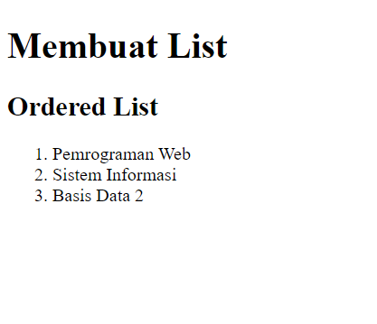

# LAB3WEB
this is my 3rd practicum assignment for the WEB Programming course

 Berikut langkah-langkah praktikum 3 : 

Instruksi Praktikum
1. Persiapkan text editor misalnya VSCode.
2. Buat folder baru dengan nama Lab3Web
3. Ikuti langkah-langkah praktikum yang akan dijelaskan berikutnya.
4. Lakukan validasi dokumen html dengan mengakses http://validator.w3.org

Selay

